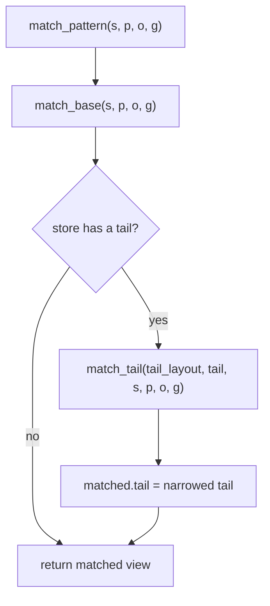
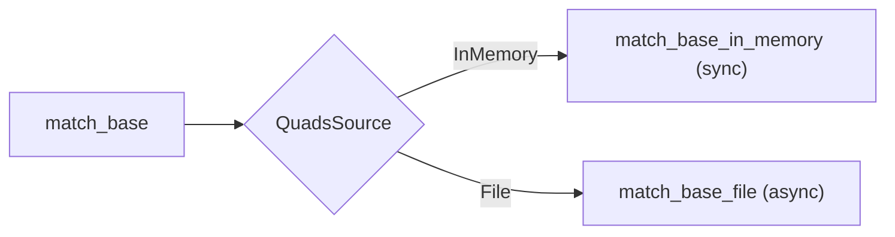
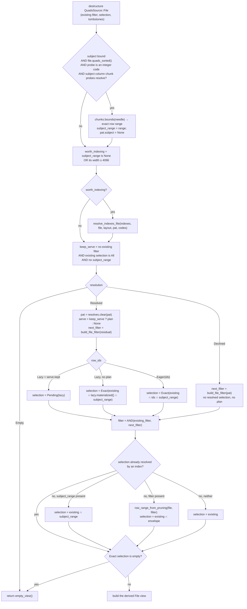
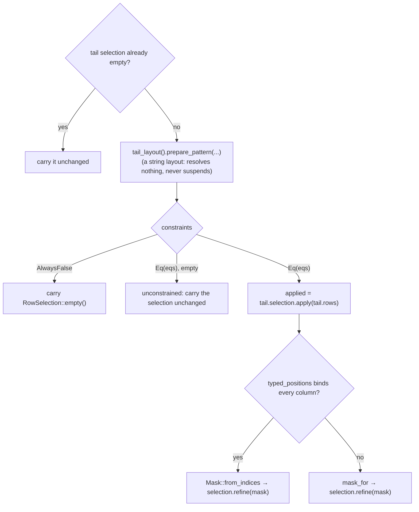

# How a quad pattern is resolved

This document traces what actually runs when a caller asks
[`VortexRdfStore::match_pattern`](../core/src/store/matching.rs) for the quads
matching a `(subject, predicate, object, graph)` pattern — every stage, every
decision point, and how the answer changes with the pattern shape, the storage
backend (in memory or file), the column layout, the secondary indexes present,
and the state of the append tail.

---

## 1. What a match produces

`match_pattern` **reads no rows**. It returns another `VortexRdfStore` — a
*derived view* over the same base data, carrying the restrictions the pattern
implies:

| Backend | Restrictions a match can compose |
|---|---|
| In memory | a `RowSelection` over base row ids (`All` / `Range` / `Ids`), plus an optional serve plan |
| File | a pushed-down filter `Expression`, a `RowSelection` over file row ids, plus an optional serve plan |

Everything a view names is a **base row id**, never a rebased position. That is
what lets secondary indexes (whose `rid` columns address base rows) survive a
match, and what lets matches be chained.

Three pieces of vocabulary recur below:

- **`RowSelection`** ([`selection.rs`](../core/src/store/selection.rs)) — `All`,
  a contiguous `Range`, or an ascending unique `Ids` list. A range and an id
  list are mutually exclusive by construction.
- **`ViewSelection`** — `Exact(RowSelection)` or `Pending(LazyRowIds)`. Pending
  means an index resolved the match but the exact ids were never computed,
  because a serve plan answers reads without them.
- **Serve plan** ([`indexes/serve.rs`](../core/src/store/indexes/serve.rs)) —
  the matched quads read straight out of the answering index's own columns
  (a contiguous run) instead of gathering the primary columns at scattered row
  ids. Purely an optimization; the row ids alone are always sufficient.

---

## 2. Top level: base and tail are matched independently



The tail branch runs **even when the base short-circuited to an empty view**.
That is deliberate: under the Dictionary layout the base's dictionary is frozen
at construction, so a term it has never seen proves nothing about rows appended
since — the tail stores terms as strings precisely so such a term can still
match. `match_base`'s `empty_view()` blanks the carried tail, and the tail match
then overwrites it with the real result.

---

## 3. Stage A — the prelude: `prepare_pattern`

Every match begins with
[`ResolvedLayout::prepare_pattern`](../core/src/store/layouts/mod.rs), which
resolves each bound term once and returns a `PatternCodes` **witness**. This is
the single point in a match where a dictionary may perform I/O; every stage
after it probes the witness synchronously.

| Layout | Residency | What the prelude does | Probe value |
|---|---|---|---|
| `Default` | — | nothing (never suspends) | the N-Triples string |
| `TypedObject` | — | nothing (never suspends) | the N-Triples string; the object decomposes into `o_kind`/`o_value`/`o_datatype`/`o_lang` |
| `Dictionary` | resident | seeds the role cache by in-memory binary search | `u32` code |
| `Dictionary` | file-backed | four **concurrent** point-read binary searches of the dictionary child (`futures::join!`), seeding every bound role | `u32` code |

The witness memoizes per role, so a fully-bound pattern costs one dictionary
search and one render per term no matter how many stages ask for it. A
file-backed witness has *no* synchronous resolver: probing a role the prelude
never bound is an error, not a silent `None`.

`PatternCodes::constraints(...)` lowers the pattern into per-column equalities —
the one source of truth shared by the in-memory mask scan and the pushed-down
file filter:

- `Default` → `s = "<iri>"`, `p = …`, `o = …`, `g = …`
- `TypedObject` → `s`, `p`, `g` as strings; the object as 2–4 equalities
- `Dictionary` → `s = 42u32`, … or **`Constraints::AlwaysFalse`** if any bound
  term is absent from the dictionary

---

## 4. Stage B — the provable-emptiness gate

```rust
if codes.provably_empty(pattern) {
    return Ok(self.empty_view());
}
```

Only the Dictionary layout can reach this: a term missing from the dictionary
cannot match any base row. No search machinery, no scan, no backend dispatch —
`empty_view()` returns a view selecting nothing, with its indexes and components
dropped (so a chained match on it runs no pointless lookups).

`provably_empty` reads the prelude-seeded role cache (`roles[r] == Some(None)`)
rather than compiling `Constraints` just to test for `AlwaysFalse`: the string
layouts answer `false` without touching it, and every stage below compiles its
own constraints over whatever the fast paths leave residual.

The string layouts (`Default`, `TypedObject`) never prove emptiness here; an
unknown term simply matches zero rows later on.

---

## 5. Stage C — backend dispatch



---

## 6. The in-memory path

[`match_base_in_memory`](../core/src/store/matching.rs) runs four stages over the
base `StructArray`, each narrowing the same `RowSelection` and clearing whatever
pattern components it answered.


### 6.1 Subject binary search

Engages when the subject is bound **and** the base's `s` column carries the
`IsSorted` stamp (written by the sorted builders). It resolves the exact
`[lo, hi)` run in `O(log n)`:

- through the store's **cached encoded-search probe**
  (`probes.by_name(base, "s")`) when the column resolves one and the probe value
  is an integer — the Dictionary layout's code column;
- otherwise through the per-call
  [`search_sorted_bounds`](../core/src/store/array.rs), which also handles the
  string layouts' `VarBinView` subject columns.

So unlike its file counterpart, the in-memory subject fast path works under
**every** layout.

### 6.2 Secondary-index routing

Both index resolvers **decline any pattern with a bound subject** — the sorted
`s` column is the better access path — so this stage only ever answers
predicate/object shapes.

The gate `worth_indexing = !narrowed_elsewhere || selection.len() >= 4096`
(`INDEX_ROUTING_MIN_ROWS`) exists because an index lookup costs
`O(rows matching that component)` regardless of how few rows the view still
holds. Once the subject search has cut the view to a handful of rows, filtering
those rows column-wise is cheaper. Nothing is lost by skipping: a view narrowed
by something else discards any serving plan anyway.

`resolve_indexes_in_memory` tries the store's indexes **in preference order**
(`SecondaryByCopy` before `SecondaryByReference`; the in-memory index set is
sorted by `preference_rank`) and takes the first that does not decline.

### 6.3 Residual column filtering

Whatever no fast path answered is compared column-wise, over **only the rows the
view still selects**. Two implementations, in order:

1. **Typed residual** ([`scan/typed_eq.rs`](../core/src/store/scan/typed_eq.rs))
   — a direct row loop yielding exact base ids, no slice/compare/mask pipeline.
   It binds each residual equality to a typed column view:
   - canonical non-nullable `u32` primitives → slice loads (and, when every
     constraint is a code compare, a branch-free `(&[u32], u32)` loop);
   - other non-nullable unsigned ints whose encoding resolves an encoded-search
     probe → per-row point reads;
   - canonical non-nullable Utf8 `VarBinView` → length-first view-level compare.

   It **declines** when any column is nullable or unsupported, when a lone
   constraint faces a wide selection (`> 4096` rows — SIMD wins there), or when
   a probe-bound (wire-encoded) column faces a wide selection.

2. **Mask scan** (`mask_for`) — the general vectorized fallback: canonicalize
   the gathered rows, broadcast each probe to a `ConstantArray`, `Eq`-compare
   per column, `And` them together, then `RowSelection::refine` translates the
   positional mask back into base row ids.

The whole stage is skipped when the fast paths resolved every component —
`mask_for` would return `None` without reading a row, but its arguments
(`selection.apply` through the array optimizer, plus a struct canonicalization)
are exactly the per-call cost the gate saves.

> **Tombstones are deliberately not consulted here.** Every read path applies
> them instead, so a match may name deleted rows without any result showing
> them. Keeping them out also keeps the mask scan's positions aligned with
> `selection.apply`, which is what `refine` maps back through.

### 6.4 Keeping (or dropping) the serve plan

A serving plan describes a contiguous run of the index's own columns. It is only
valid when that run **is** the whole result, so it survives only if:

```
unrefined (the view started as All)  AND  nothing else narrowed the view
```

A deferred (`Pending`) selection is kept under the strictly stronger condition
that additionally requires nothing to be left bound — which is why a pending
selection always rides with a plan.

---

## 7. The file path

[`match_base_file`](../core/src/store/matching.rs) composes the same
restrictions, but nothing is read: the result is a filter expression plus a row
selection, applied by the *next* scan.



### 7.1 Subject chunk probe

The file mirror of the in-memory subject binary search: it binary-searches the
subject column's **encoded chunks** through cached chunk probes, reading only the
chunks the bisection touches. It requires `u64::try_from(&probe)` to succeed, so
it engages **only under the Dictionary layout** — a string-subject file falls
through to zone-map pruning.

It also declines for an unsorted file, a missing chunk handle, or an unsupported
chunk encoding. Both index resolvers decline bound-subject patterns, so this
fast path takes an uncontested route.

### 7.2 Zone-map pruning

When no index resolved anything and no subject range was found,
[`row_range_from_pruning`](../core/src/store/scan/file_scan.rs) runs one
`pruning_evaluation` per filter conjunct over the whole file — statistics only,
no row data — and collapses the surviving mask to its enclosing contiguous
range. Interior gaps are kept (the scan's own per-split pruning skips them from
the same cached zone masks); only outer dead space is trimmed. The envelope is
memoized on the shared file handle, keyed by the filter expression.

Results: `Some(0..0)` when nothing can match, `None` when statistics exclude
nothing.

### 7.3 What ends up on the view

- **Filter** — the residual pattern, ANDed onto whatever earlier matches left.
  Components an index resolved are *excluded*: the row ids already are exactly
  their matches, so re-filtering would only re-read and re-compare that column.
- **Selection** — index ids, a subject range, a pruning envelope, or `All`.
- **Serve plan** — kept only when this match is the view's sole restriction.
- **Tombstones** — a property of the file, not the pattern; they carry across
  unchanged and every read path applies them.

---

## 8. The index resolvers

Each index owns its own execution and answers in one shared currency:
`IndexResolution` — `Declined`, `Empty`, or `Resolved { row_ids, resolves, serve }`,
where `row_ids` are ascending unique **base** row ids.

### 8.1 Which index handles which shape

`choose()` in each index module, independent of backend:

| Pattern (s, p, o) | `SecondaryByCopy` | `SecondaryByReference` |
|---|---|---|
| subject bound (any shape) | **declines** | **declines** |
| `p` bound, `o` bound | `index:posg`, `(p, o)` prefix probe → resolves **PredicateObject** | `index:ref-o` on the object → resolves **Object** |
| `p` bound only | `index:posg` lead probe → resolves **Predicate** | `index:ref-p` → resolves **Predicate** |
| `o` bound only | `index:ospg` lead probe → resolves **Object** | `index:ref-o` → resolves **Object** |
| neither bound | **declines** | **declines** |

A bound **graph** never routes: neither index sorts by it. It always stays in
the residual (a mask scan in memory, a filter conjunct on file) — except inside
a `FileServePlan`, which carries a graph equality of its own (see 8.4).

### 8.2 `SecondaryByCopy` — two sorted quad copies

Children: `index:posg` (quads sorted by p, o, s, g) and `index:ospg` (sorted by
o, s, p, g), each `{s, p, o, g, rid}`, term strings or `u32` codes.

**In memory:** requires the family's component to exist and be *globally* sorted
(`IndexComponent::find_sorted` — per-chunk sorted data is not binary-searchable).
Binary-searches the lead column for the probe run, then — for a `(p, o)` pattern
— re-searches the second key **within** that run (valid because the family's full
comparator makes the second column sorted inside each lead run). It returns:

- `Empty` if the probe term is absent from the dictionary, or the run is empty;
- `Declined` if the component is missing, unsorted, or probe-incompatible;
- otherwise `Resolved` with **`Lazy` row ids** (the rid slice, decoded and
  re-sorted only on demand) and **always a serve plan** over the matched run.

**On file:** locates the run by binary-searching the child's cached chunk probes
(lead, then a windowed second-key search), integers only. Then:

| Located run | Row ids |
|---|---|
| empty | `IndexResolution::Empty` |
| ≤ 256 rows (`POINT_GATHER_MAX_ROWS`) | **Eager**, via `rid_point_reads` |
| wider, or unlocated | **Lazy** — a deferred rid-only pushed-down scan |

The serve plan is built from *every* bound non-subject component (p, o, **g**).
Its `row_range` is kept only when the graph is unbound, since the location
searched sort keys only. If a bound residual term has no dictionary code the
plan cannot be built, and the resolution falls back to an eager filtered scan.

### 8.3 `SecondaryByReference` — sorted `{val, rid}` pairs

Children: `index:ref-o` and `index:ref-p`. Stores no whole quads, so it **never
supplies a serve plan** and its row ids are **always eager**.

**In memory:** binary-search the sorted `val` column, slice the paired `rid`
run, `sorted_row_ids` puts them back in base row order. Declines when the
component is absent, unsorted, or probe-incompatible.

**On file:** `locate_run` binary-searches the value column's chunk probes
(sorted child + integer probe required). A located run ≤ 256 rows uses
`rid_point_reads`; a wider one uses a rid-only scan restricted to the range —
neither pays filter evaluation. Anything the probes decline falls back to
`scan_index_row_ids`, a pushed-down `val == probe` scan that answers whatever the
order.

### 8.4 Serve plans, side by side

| | `InMemoryServePlan` | `FileServePlan` |
|---|---|---|
| Acquisition | slice the component's `[start, end)` run, or point-read it through cached probes when ≤ 256 rows | pushed-down projected+filtered scan of the index child, or `component_point_chunk` point reads over a located run ≤ 256 rows |
| Constraints | implicit in the run's bounds (lead ± second key) | explicit `p`/`o`/`g` term equalities, bound lazily on first read |
| Dropped when | anything else narrowed the view (including a bound graph, which forces a residual scan) | an earlier filter/selection exists, or a subject range applies |
| Tombstones | applied through the plan's `rid` column | applied through the plan's `rid` column |

Both decode through the shared `ServeDecode` tail, relabelling the index's
columns as the primary `(s, p, o, g)` and decoding through the layout the copies
store (`Dictionary` codes, else `Default` strings — even a TypedObject store's
copies decode as `Default`).

---

## 9. The tail

[`match_tail`](../core/src/store/matching.rs) narrows the append tail — small,
unsorted, unindexed — so a scan over its already-few selected rows is the whole
plan.



Notes:

- **`tail_layout()`** is the store's own layout, except under `Dictionary`,
  where it is `Default`: an appended term has no code in the frozen sorted
  dictionary, so the tail keeps N-Triples strings. Patterns therefore probe the
  base **by code** and the tail **by string**, with two separate witnesses.
- Because the tail's layout is always a string layout, the `AlwaysFalse` arm
  cannot fire today; it is the structural counterpart of the base's gate.
- The typed path is what every `contains` — and therefore every `add_quad`
  presence check — rides: raw byte compares over the tail's string columns, no
  per-call compare/canonicalize pipeline.
- `typed_positions` accepts a flat canonical struct **or** a chunked accretion
  of them, which is the shape `add_quads` builds.

---

## 10. Pattern-shape cheat sheet

Assuming a store built with sorted subjects and (where stated) secondary
indexes. `→` reads "then".

### 10.1 In memory

| Pattern | Dictionary layout, `SecondaryByCopy` | Dictionary layout, `SecondaryByReference` | No indexes |
|---|---|---|---|
| `????` (nothing bound) | no work: selection stays `All` | same | same |
| `S???` | subject binary search → `Range` | same | same |
| `?P??` | POSG lead probe → lazy ids **+ serve plan** | ref-p probe → eager ids | typed/mask scan of `p` over all rows |
| `??O?` | OSPG lead probe → lazy ids **+ serve plan** | ref-o probe → eager ids | typed/mask scan of `o` |
| `?PO?` | POSG `(p, o)` prefix probe → both resolved, lazy ids **+ serve plan** | ref-o probe (object preferred) → eager ids → residual `p` scan | typed/mask scan of `p ∧ o` |
| `???G` | indexes decline → typed/mask scan of `g` | same | same |
| `?P?G` | POSG lead probe → residual `g` scan **drops the plan**, ids materialize | ref-p probe → residual `g` scan | typed/mask scan |
| `SP??` / `S?O?` / `SPO?` | subject range; indexes decline (subject bound); residual scan over the range — index routing skipped entirely if the range is < 4096 rows | same | same |
| `SPOG` (`contains`) | subject range → residual `p ∧ o ∧ g` typed loop over a handful of rows | same | same |

Under the string layouts (`Default`, `TypedObject`) the same routes apply; only
the probe values change (strings instead of codes), and the object of a
`TypedObject` store expands into 2–4 residual equalities.

### 10.2 File-backed

| Pattern | Dictionary layout, `SecondaryByCopy` | Dictionary layout, `SecondaryByReference` | No indexes |
|---|---|---|---|
| `????` | selection `All`, no filter | same | same |
| `S???` | subject chunk probe → exact `Range`, no filter | same | same |
| `?P??` | POSG located run → eager ids (≤ 256) or lazy ids **+ serve plan** | ref-p located run → eager ids; filter empty | filter `p = code` → pruning envelope |
| `??O?` | OSPG located run → same as above | ref-o located run → eager ids | filter `o = code` → pruning envelope |
| `?PO?` | POSG `(p, o)` windowed location → both resolved, **serve plan** | ref-o located run → eager ids, filter keeps `p` | filter `p ∧ o` → pruning envelope |
| `?POG` | as above; plan carries `g` too, but its `row_range` is dropped | ref-o ids; filter keeps `p ∧ g` | filter `p ∧ o ∧ g` |
| `SP??` … `SPOG` | subject range; index routing skipped when the range is < 4096 rows; residual becomes the pushed filter | same | subject range (or pruning envelope) + residual filter |

Under the string layouts the subject chunk probe and both indexes' `locate_run`
decline (they need integer probes), so a file match reduces to *pushed-down
filter + zone-map pruning* — plus, for `SecondaryByCopy`, a filtered index-child
scan that still supplies a serve plan.

---

## 11. Chained matches

`match_pattern` on an already-derived view composes rather than rebases:

- In memory, a still-`Pending` selection **materializes** at the top of
  `match_base_in_memory` (`selection.materialized_sync()`) — chaining is one of
  the consumers the deferral exists for. `unrefined` is then false, so no serve
  plan can be kept.
- On file, `existing_filter` is ANDed with the new one and `existing_selection`
  is intersected; `keep_serve` is false the moment either is non-trivial.
- The base array / file handle and the index components are **shared**, not
  rebuilt: the selection names base row ids, which no narrowing renumbers. Only
  a physical gather (compaction) invalidates them, and that rebuilds the index
  set over the new order.
- The tail's own selection is tail-local and narrows independently on each call.

---

## 12. What the derived view costs at read time

The match's decisions show up here
([`streaming.rs`](../core/src/store/streaming.rs),
[`rows.rs`](../core/src/store/rows.rs)):

| Consumer | With a serve plan | Without |
|---|---|---|
| `quads()` / `quads_vec()` | decode the plan's run (in memory: slice or point reads; file: point reads ≤ 256 rows, else projected+filtered scan) — the pending ids are never touched | gather the selection from the primaries, or run the restricted file scan |
| `size()` | in memory a lazy component run knows its width without decoding; on file a count **must** materialize the ids (then counts filter masks if a filter is pending) | selection length, or `count_matching_rows` over the filter |
| `code_columns()` | read the four `u32` columns straight off the index's own columns | materialize the selection, then slice/gather the base's buffers |
| `raw_quad_chunks()` | plan deliberately ignored (it reorders rows; the N-Triples export is order-insignificant) | restricted scan in base row order |

`LazyRowIds` caches into a shared `OnceLock`, so the first consumer that needs
the ids pays for them once and every clone of the view reads them back for free.

---

## 13. Decision points at a glance

| # | Where | Condition | Consequence |
|---|---|---|---|
| 1 | `match_base` | `codes.provably_empty(pattern)` — a bound role resolved to no code | `empty_view()`, no backend work |
| 2 | in memory | `s` bound ∧ `s` stamped sorted ∧ probe casts | binary-search `[lo, hi)`; subject cleared |
| 3 | in memory | selection non-empty ∧ (`!narrowed_elsewhere` ∨ `len ≥ 4096`) | try index routing |
| 4 | in memory | resolution `Lazy` ∧ unrefined ∧ untouched ∧ nothing bound ∧ plan | defer the ids (`Pending`) |
| 5 | in memory | selection non-empty ∧ something still bound | residual filtering |
| 6 | in memory | every residual column typed-bindable ∧ not (single eq over > 4096 rows) ∧ no probe-bound column over a wide selection | typed row loop, else mask scan |
| 7 | in memory | `unrefined ∧ !narrowed_elsewhere` | keep the serve plan |
| 8 | file | `s` bound ∧ `quads_sorted` ∧ integer probe ∧ chunk probes resolve | exact subject row range; subject cleared |
| 9 | file | no subject range ∨ range ≥ 4096 rows | try index routing |
| 10 | file | no existing filter ∧ existing selection `All` ∧ no subject range | `keep_serve` |
| 11 | file | resolution `Lazy` ∧ plan kept | selection stays `Pending` |
| 12 | file | no index resolution ∧ no subject range ∧ filter present | zone-map pruning envelope |
| 13 | file | `Exact` selection empty | `empty_view()` |
| 14 | tail | tail selection empty | carry unchanged |
| 15 | tail | no equalities | every selected tail row matches |
| 16 | tail | `typed_positions` binds every column | typed positions, else mask scan |

### Tuning constants

| Constant | Value | Defined in | Meaning |
|---|---|---|---|
| `INDEX_ROUTING_MIN_ROWS` | 4096 | [`matching.rs`](../core/src/store/matching.rs) | an already-narrowed view below this skips index routing |
| `POINT_GATHER_MAX_ROWS` | 256 | [`selection.rs`](../core/src/store/selection.rs) | runs/selections at or below this are read point-by-point through cached probes |
| `TYPED_SINGLE_EQ_MAX_ROWS` | 4096 | [`typed_eq.rs`](../core/src/store/scan/typed_eq.rs) | above this, a lone residual equality goes to the vectorized mask scan |

---

## 14. Source map

| Concern | File |
|---|---|
| `match_pattern`, `match_base`, both backends, `match_tail`, `mask_for`, `contains` | [`core/src/store/matching.rs`](../core/src/store/matching.rs) |
| Layouts, `QuadPattern`, `PatternCodes`, `Constraints`, `prepare_pattern` | [`core/src/store/layouts/mod.rs`](../core/src/store/layouts/mod.rs) |
| Dictionary residency and the async prelude | [`core/src/store/layouts/dictionary/access.rs`](../core/src/store/layouts/dictionary/access.rs) |
| `RowSelection` / `ViewSelection`, gathering, point reads | [`core/src/store/selection.rs`](../core/src/store/selection.rs) |
| `IndexResolution`, `ResolvedRowIds`, `LazyRowIds`, planners | [`core/src/store/indexes/mod.rs`](../core/src/store/indexes/mod.rs) |
| Sorted quad copies (POSG / OSPG) | [`core/src/store/indexes/secondary_by_copy.rs`](../core/src/store/indexes/secondary_by_copy.rs) |
| Sorted `{val, rid}` pairs | [`core/src/store/indexes/secondary_by_reference.rs`](../core/src/store/indexes/secondary_by_reference.rs) |
| Serve plans and the shared decode tail | [`core/src/store/indexes/serve.rs`](../core/src/store/indexes/serve.rs) |
| Pushed-down filters, split evaluation, pruning, point reads | [`core/src/store/scan/file_scan.rs`](../core/src/store/scan/file_scan.rs) |
| Typed residual/tail equality loops | [`core/src/store/scan/typed_eq.rs`](../core/src/store/scan/typed_eq.rs) |
| View state (`QuadsSource`, `Tail`) | [`core/src/store/source.rs`](../core/src/store/source.rs) |
| Read paths consuming the view | [`core/src/store/streaming.rs`](../core/src/store/streaming.rs), [`core/src/store/rows.rs`](../core/src/store/rows.rs) |
